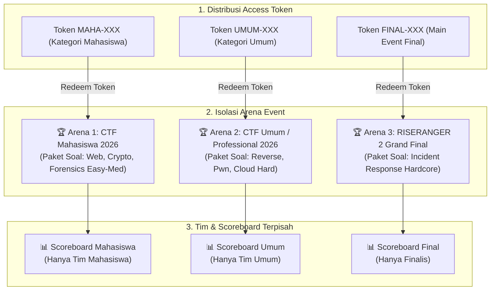
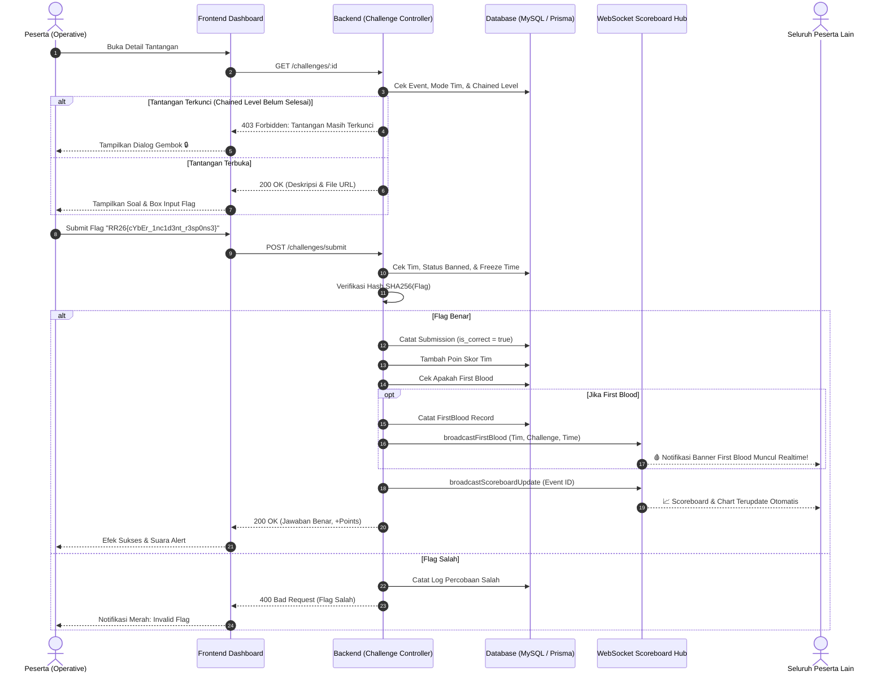
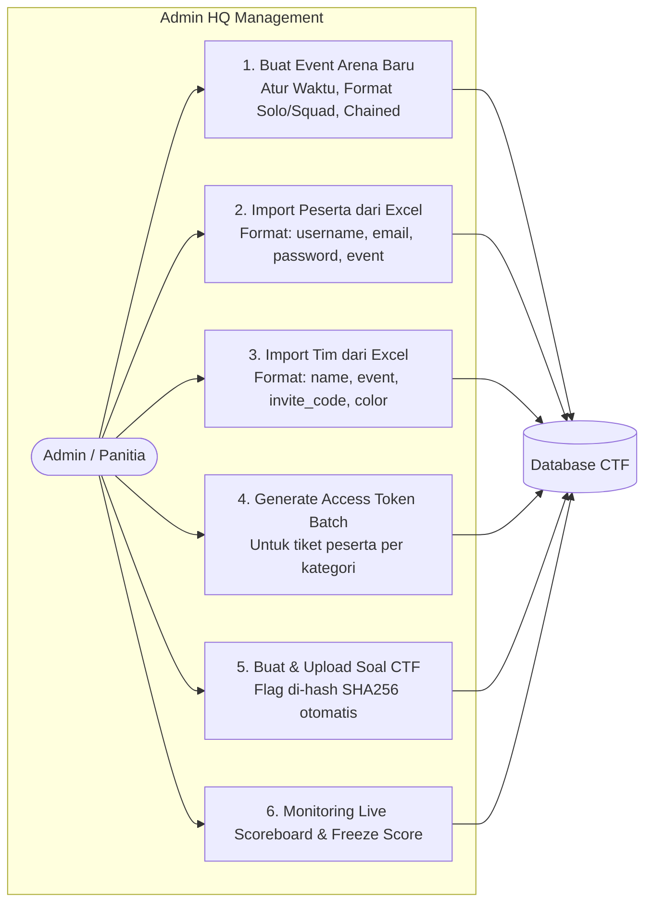
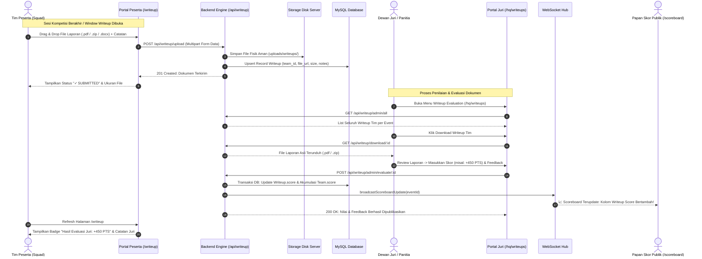

# 🛡️ RISERANGER 2 — INCIDENT RESPONSE & CTF PLATFORM
### *Panduan Lengkap Arsitektur Sistem, Alur Kompetisi, dan Diagram Alir (Tournament Workflow)*

---

## 📑 Daftar Isi
1. [Gambaran Umum Sistem](#1-gambaran-umum-sistem)
2. [Arsitektur & Komponen Teknologi](#2-arsitektur--komponen-teknologi)
3. [Fitur Keamanan & Anti-Cheat](#3-fitur-keamanan--anti-cheat)
4. [Diagram Alur Kompetisi (Tournament Flow)](#4-diagram-alur-kompetisi-tournament-flow)
   - [Diagram 1: Alur Lengkap Peserta (End-to-End Participant Flow)](#diagram-1-alur-lengkap-peserta-end-to-end-participant-flow)
   - [Diagram 2: Isolasi Multi-Event Arena & Token Kategorisasi](#diagram-2-isolasi-multi-event-arena--token-kategorisasi)
   - [Diagram 3: Siklus Validasi Flag, Chained Mode, & First Blood](#diagram-3-siklus-validasi-flag-chained-mode--first-blood)
   - [Diagram 4: Alur Manajemen Panitia / Admin HQ](#diagram-4-alur-manajemen-panitia--admin-hq)
5. [Panduan Operasional Panitia (Admin Guide)](#5-panduan-operasional-panitia-admin-guide)
6. [Panduan Peserta (Participant Guide)](#6-panduan-peserta-participant-guide)
7. [Struktur Data & Skema Database](#7-struktur-data--skema-database)

---

## 1. Gambaran Umum Sistem

**RISERANGER 2 Incident Response & CTF Platform** adalah platform kompetisi keamanan siber (*Cybersecurity Capture The Flag*) modern berbasis web berkinerja tinggi. Platform ini dirancang untuk menyelenggarakan kompetisi berstandar industri dengan dukungan **Multi-Event Arena**, **Tiket Akses Terisolasi (Access Token)**, **Chained Challenge Progression**, **Realtime WebSocket Scoreboard**, serta fitur **Import Batch Spreadsheet (XLSX/CSV)** untuk memudahkan manajemen ribuan peserta dan tim.

---

## 2. Arsitektur & Komponen Teknologi

```
+-----------------------------------------------------------------------------+
|                                FRONTEND (SPA)                               |
|   React 18 + TypeScript + Vite + Tailwind CSS + Radix UI + Lucide + Socket.io|
+-----------------------------------------------------------------------------+
                                       |
                              HTTPS / WSS (REST & WS)
                                       |
+-----------------------------------------------------------------------------+
|                               BACKEND ENGINE                                |
|          Bun Runtime + Express.js + Prisma ORM + Socket.io Server           |
+-----------------------------------------------------------------------------+
                       |                               |
        +--------------+---------------+       +---------------+---------------+
        |                              |       |                               |
+---------------+              +---------------+                       +---------------+
| MySQL / MariaDB|              |  Redis Server |                       | File Storage  |
|  (Data Relasi)|              | (Cache/Limits)|                       | (Attachments) |
+---------------+              +---------------+                       +---------------+
```

* **Frontend**: React 18, Vite, TypeScript, Tailwind CSS, Radix UI Dialogs/Dropdowns, Sonner Toaster, SheetJS (XLSX).
* **Backend**: Bun v1.3+, Express.js, TypeScript, Prisma ORM v5, Socket.io Server, Bcrypt, JsonWebToken.
* **Database**: MySQL 8 / MariaDB (relational persistence).
* **In-Memory Cache**: Redis (Scoreboard caching, rate-limiting, dynamic captcha fallback).

---

## 3. Fitur Keamanan & Anti-Cheat

1. **Anti-Bruteforce & Rate Limiter**:
   - `authLimiter`: Maksimal 6 percobaan login/registrasi per menit per IP.
   - `submissionLimiter`: Proteksi anti-spam pengiriman flag dan anti-bruteforce flag.
2. **SVG Dynamic Captcha (Anti-Bot)**:
   - 4 karakter kontras tinggi yang jelas dan tidak ambigu (bebas dari 0/O dan 1/I/L).
   - Single-use token dengan masa berlaku 5 menit.
3. **Isolasi Soal & Proteksi Sniffing Jaringan**:
   - Endpoint overview `GET /challenges` hanya mengirim judul, poin, dan kategori.
   - Kolom `description`, `file_url`, dan `hint` **disembunyikan** dari payload jaringan dan hanya bisa diakses melalui `GET /challenges/:id` jika peserta memiliki tiket event yang sah dan kompetisi telah dimulai.
4. **Chained Challenges Mode**:
   - Tantangan level lanjutan dalam kategori yang sama terkunci sampai tantangan sebelumnya berhasil diselesaikan (*solved*).
5. **Scoreboard Freeze Time**:
   - Membekukan papan skor pada sisa waktu tertentu menuju akhir kompetisi untuk menjaga ketegangan kompetisi.

---

## 4. Diagram Alur Kompetisi (Tournament Flow)

### Diagram 1: Alur Lengkap Peserta (End-to-End Participant Flow)

```mermaid
flowchart TD
    A([Mulai: Calon Peserta]) --> B[Buka Halaman Register]
    B --> C[Isi Username, Email, Password & Captcha 4 Karakter]
    C --> D{Verifikasi Captcha Benar?}
    D -- Tidak --> E[Muncul Pesan Error & Refresh Captcha] --> B
    D -- Ya --> F[Akun Terdaftar: Login ke Platform]
    
    F --> G[Masuk Dashboard: Status Unverified]
    G --> H[Buka Halaman /join: Masukkan Access Token]
    H --> I{Validasi Access Token}
    I -- Salah/Kadaluarsa --> J[Error: Token Tidak Valid] --> H
    I -- Berhasil --> K[Akun Terikat ke Event Arena Tertentu\nContoh: Kategori Mahasiswa 2026]
    
    K --> L{Mode Partisipasi Event?}
    L -- Solo / Individual --> M[Langsung Akses Soal CTF]
    L -- Squad / Team Only --> N[Buka Menu Team / Squad]
    
    N --> O{Pilihan Squad}
    O -- Buat Tim Baru --> P[Input Nama Tim -> Jadi Leader Tim]
    O -- Gabung Tim Teman --> Q[Input Kode Invite Tim]
    
    P --> R[Masuk Arena CTF]
    Q --> R
    M --> R
    
    R --> S[Pilih Soal Tantangan Berdasarkan Kategori]
    S --> T[Analisis Soal / Unduh File Attachment]
    T --> U[Dapatkan Flag: Format RR26{...}]
    U --> V[Kirim Flag ke Server]
    
    V --> W{Flag Valid & Tepat?}
    W -- Salah --> X[Catat Submission Salah & Notifikasi Gagal] --> S
    W -- Benar --> Y[Poin Ditambahkan ke Tim/Akun]
    Y --> Z{Apakah Solves Pertama di Arena?}
    Z -- Ya --> FB[Dapatkan Gelar FIRST BLOOD 🩸]
    Z -- Tidak --> SC[Update Live Scoreboard & Graf Poin]
    FB --> SC
    SC --> END([Selesai / Lanjut ke Soal Berikutnya])
```

---

### Diagram 2: Isolasi Multi-Event Arena & Token Kategorisasi



---

### Diagram 3: Siklus Validasi Flag, Chained Mode, & First Blood



---

### Diagram 4: Alur Manajemen Panitia / Admin HQ



---

### Diagram 5: Alur Pengumpulan & Penilaian Dokumen Writeup (Jury Scoring Flow)



---

## 5. Panduan Operasional Panitia (Admin Guide)


### 1. Membuat Event Arena Baru (`/hq/events`)
1. Buka menu **Admin HQ -> Event Configuration**.
2. Klik tombol **`+ Create Event`**.
3. Isi parameter event:
   - **Event Name**: Nama resmi event (misal: *CTF Kategori Mahasiswa 2026*).
   - **Master Join Token**: Kode tiket master (misal: `MAHA2026`).
   - **Format Partisipasi**: Pilih `Squad Only (Wajib Tim)`, `Solo Only (Individu)`, atau `Hybrid`.
   - **Max Anggota per Tim**: Batas kapasitas per squad (misal 3 atau 5 orang).
   - **Timing Schedule**: Jadwal *Start Time*, *End Time*, dan *Scoreboard Freeze Time*.
   - **Chained Mode**: Centang jika ingin soal bertingkat per kategori.

### 2. Import Data Pengguna & Tim dari Excel (`/hq/users` & `/hq/teams`)
* **Import Users (XLSX)**:
  1. Buka menu **User Management** -> Klik **`Import Users (XLSX)`**.
  2. Unduh template resmi `.XLSX`.
  3. Isi kolom: `username`, `email`, `password`, `role`, `event_name`.
  4. Upload file dan klik **`Impor User`**. Password akan otomatis di-hash dengan aman.
* **Import Squads (XLSX)**:
  1. Buka menu **Team Moderation** -> Klik **`Import Squads (XLSX)`**.
  2. Unduh template resmi `.XLSX`.
  3. Isi kolom: `name`, `event_name`, `invite_code`, `color`, `score`.
  4. Upload file dan klik **`Impor Tim`**.

### 3. Manajemen Token Akses (`/hq/tokens`)
1. Buka menu **Access Tokens**.
2. Pilih tab event arena yang dituju.
3. Klik **`+ Generate Token Batch`** (misal buat 50 token sekaligus dengan label `Batch Kampus A`).
4. Bagikan token tiket kepada masing-masing perwakilan peserta.

### 4. Evaluasi & Penilaian Dokumen Writeup Juri (`/hq/writeups`)
1. Buka menu **Admin HQ -> Writeup Evaluation**.
2. Pilih arena event yang sedang dinilai.
3. Klik tombol **Download File** pada baris tim peserta untuk membaca laporan investigasi insiden (.pdf/.zip/.docx).
4. Klik tombol **`Beri Nilai` / `Edit Nilai`**:
   - Masukkan **Poin Penilaian Juri (Score)**, misal 0 s/d 1000 poin.
   - Tuliskan **Catatan & Feedback Dewan Juri** (metodologi, PoC, mitigasi).
5. Klik **Simpan & Publikasikan Nilai**:
   - Poin laporan langsung ditambahkan ke total skor tim (`Team.score` & `Team.writeup_score`).
   - Server otomatis menyiarkan perubahan peringkat ke **Live Scoreboard** via WebSocket secara realtime!

---

## 6. Panduan Peserta (Participant Guide)

1. **Registrasi Akun**:
   - Buka `/register`. Isi form dan masukkan 4 karakter Captcha.
2. **Login & Tukar Token**:
   - Login di `/login`.
   - Di Dashboard, klik tombol **Masukkan Access Token** menuju `/join`.
   - Masukkan token yang didapat dari panitia (misal: `RR26-MHS-1029`).
3. **Bentuk atau Gabung Squad (Jika Event Mode Tim)**:
   - Buka menu **Team** (`/team`).
   - Buat tim baru dengan memasukkan nama tim, atau gabung ke tim teman menggunakan **Invite Code**.
4. **Mengerjakan Tantangan**:
   - Buka menu **Challenges** (`/`).
   - Pilih kategori (*Web Exploitation, Cryptography, Reverse Engineering, Incident Response, Forensics*).
   - Analisis soal, temukan kerentanan, dan submit flag dengan format `RR26{...}`.
5. **Pengumpulan Dokumen Writeup Pasca Lomba**:
   - Setelah atau menjelang sesi kompetisi berakhir, buka menu **`Writeup / Report`** (`/writeup`).
   - Unggah file laporan investigasi tim (.pdf / .zip / .docx / .md, maks 50MB).
   - Tuliskan catatan investigasi tambahan dan klik **Kirim Laporan Writeup**.
   - Pantau hasil penilaian skor dan feedback review dari Dewan Juri.
6. **Pantau Papan Skor**:
   - Buka menu **Scoreboard** (`/scoreboard`) untuk melihat peringkat akhir (akumulasi poin flag CTF + poin laporan writeup), grafik progression, dan peraih *First Blood*.

---

## 7. Struktur Data & Skema Database

| Entitas Model | Tabel MySQL | Penjelasan & Atribut Utama |
| :--- | :--- | :--- |
| **`Event`** | `events` | Wadah arena kompetisi (`id`, `name`, `join_token`, `participation_mode`, `max_team_size`, `start_time`, `end_time`, `is_chained`, `is_frozen`). |
| **`EventToken`** | `event_tokens` | Tiket akses unik per event (`id`, `token`, `event_id`, `label`, `is_used`, `used_by_user_id`). |
| **`User`** | `users` | Akun peserta/admin (`id`, `username`, `email`, `password_hash`, `role`, `event_id`). |
| **`Team`** | `teams` | Squad kompetisi (`id`, `name`, `invite_code`, `leader_id`, `score`, `writeup_score`, `color`, `event_id`, `is_banned`). |
| **`TeamMember`**| `team_members` | Relasi anggota tim (`id`, `team_id`, `user_id`, `joined_at`). |
| **`Challenge`** | `challenges` | Soal CTF (`id`, `title`, `description`, `category`, `points`, `flag_hash`, `hint`, `hint_cost`, `file_url`, `event_id`). |
| **`Submission`** | `submissions` | Log pengiriman flag (`id`, `team_id`, `user_id`, `challenge_id`, `is_correct`, `submitted_at`). |
| **`FirstBlood`** | `first_bloods`| Rekor pemecah soal pertama (`id`, `challenge_id`, `team_id`, `achieved_at`). |
| **`Writeup`** | `writeups` | Dokumen laporan investigasi & penilaian juri (`id`, `team_id`, `user_id`, `event_id`, `file_url`, `file_name`, `file_size`, `score`, `feedback`, `evaluated_by`, `evaluated_at`, `submitted_at`). |

---

> 💡 **Tips Pengoperasian**: Jalankan perintah `bun run seed` untuk menginisialisasi arena perlombaan awal lengkap dengan akun admin, event mahasiswa/umum, token siap pakai, dan kumpulan soal tantangan standar.

