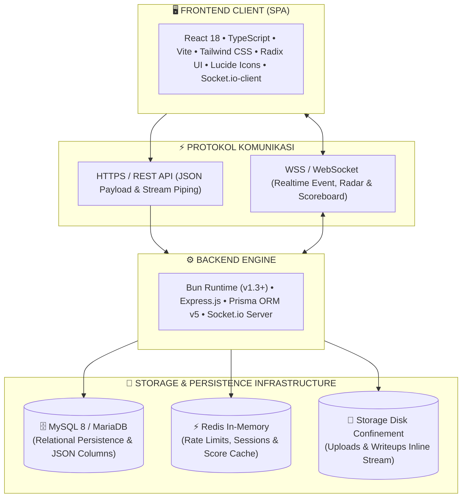
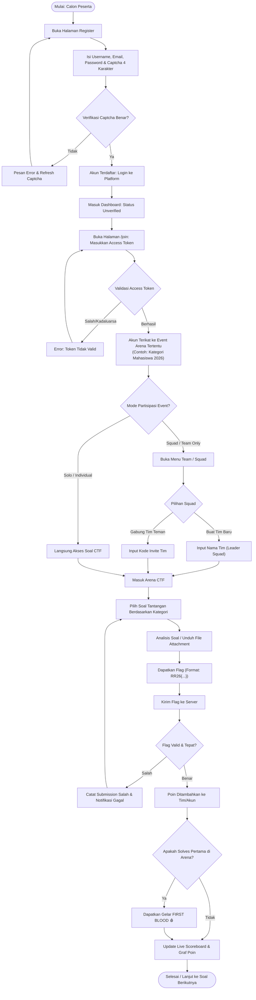
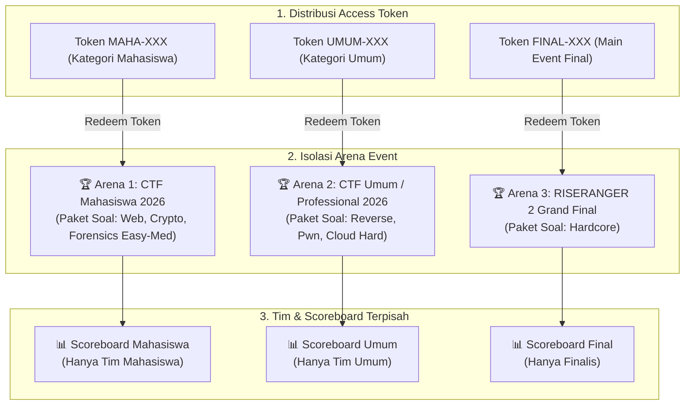
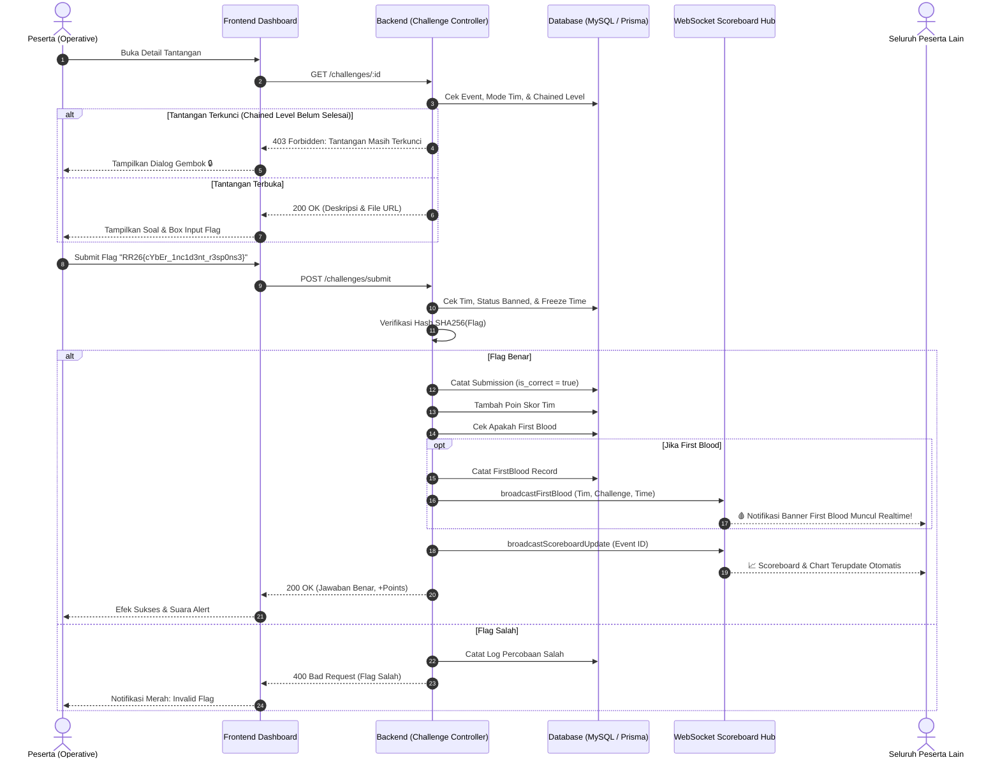
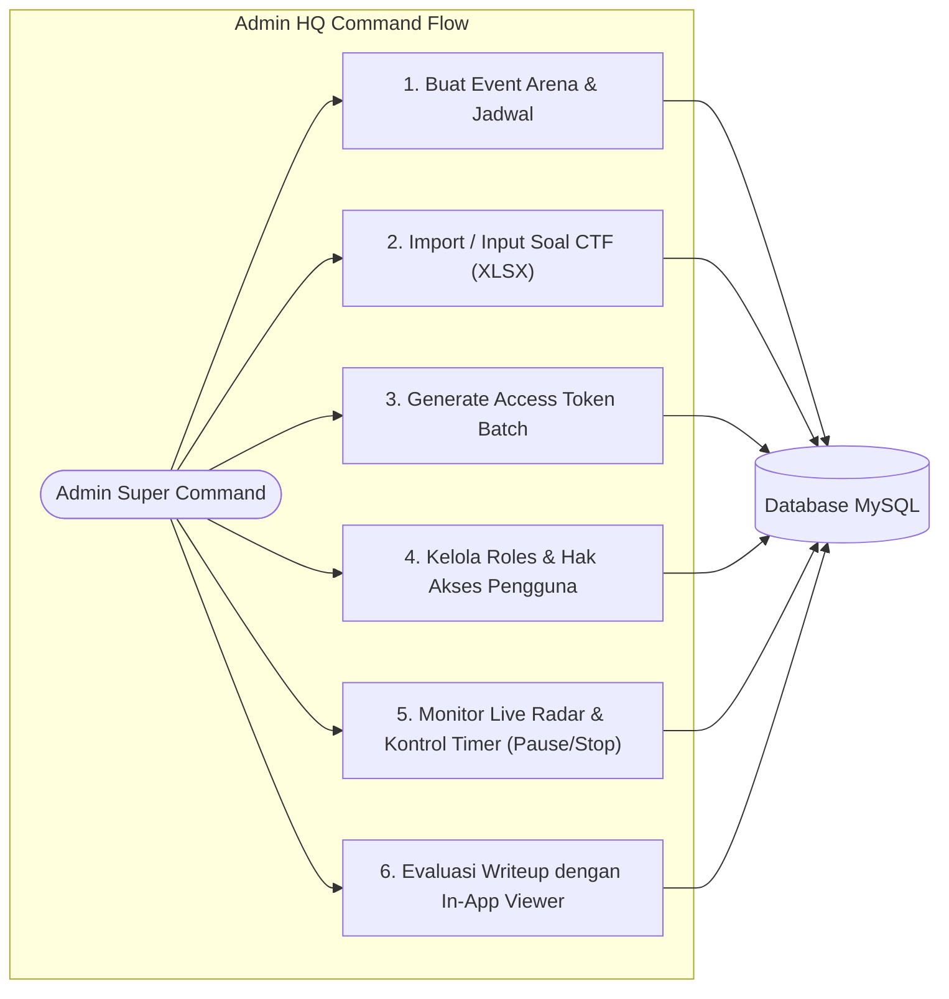
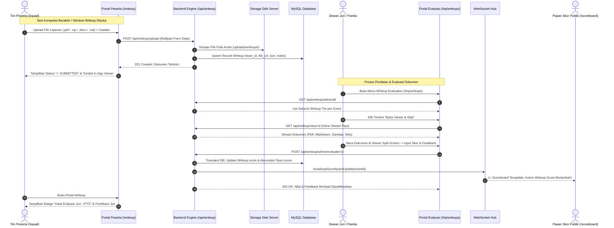
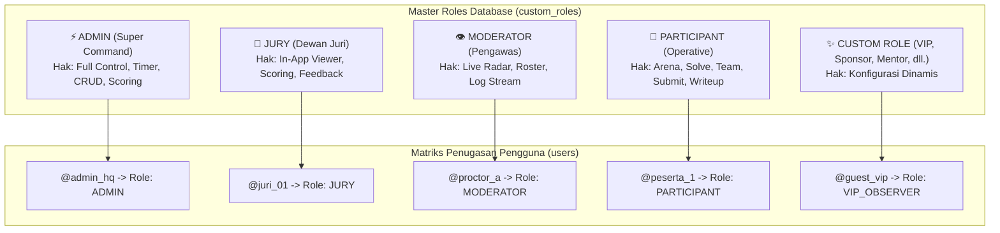

# 🛡️ RISERANGER 2 — CYBERSECURITY INCIDENT RESPONSE & CTF PLATFORM
### *Panduan Lengkap Arsitektur Sistem, Alur Kompetisi, dan Diagram Alir (Tournament Workflow)*

---

## 📑 Daftar Isi
1. [Gambaran Umum Sistem](#1-gambaran-umum-sistem)
2. [Arsitektur & Komponen Teknologi](#2-arsitektur--komponen-teknologi)
3. [Fitur Keamanan, Anti-Cheat & Confinement](#3-fitur-keamanan-anti-cheat--confinement)
4. [Diagram Alur Kompetisi (Tournament Flow)](#4-diagram-alur-kompetisi-tournament-flow)
   - [Diagram 1: Alur Lengkap Peserta (End-to-End Participant Flow)](#diagram-1-alur-lengkap-peserta-end-to-end-participant-flow)
   - [Diagram 2: Isolasi Multi-Event Arena & Token Kategorisasi](#diagram-2-isolasi-multi-event-arena--token-kategorisasi)
   - [Diagram 3: Siklus Validasi Flag, Chained Mode, & First Blood](#diagram-3-siklus-validasi-flag-chained-mode--first-blood)
   - [Diagram 4: Alur Manajemen Panitia HQ Command](#diagram-4-alur-manajemen-panitia-hq-command)
   - [Diagram 5: Alur Pengumpulan, In-App Viewer & Penilaian Writeup](#diagram-5-alur-pengumpulan-in-app-viewer--penilaian-writeup)
   - [Diagram 6: Arsitektur Master Roles & Dynamic Permissions](#diagram-6-arsitektur-master-roles--dynamic-permissions)
5. [Panduan Operasional Panitia & Admin HQ (`/hq`)](#5-panduan-operasional-panitia--admin-hq-hq)
6. [Panduan Dewan Juri & Moderator Pengawas](#6-panduan-dewan-juri--moderator-pengawas)
7. [Panduan Peserta (Participant Guide)](#7-panduan-peserta-participant-guide)
8. [Struktur Data & Skema Database](#8-struktur-data--skema-database)

---

## 1. Gambaran Umum Sistem

**RISERANGER 2** adalah platform simulasi respons insiden siber (*Cybersecurity Incident Response & Capture The Flag*) modern berbasis web berkinerja tinggi. Platform ini dirancang untuk menyelenggarakan kompetisi berstandar industri dengan dukungan:
- **Multi-Event Arena**: Isolasi arena lomba (contoh: Mahasiswa, Umum, Professional, Grand Final).
- **Single-Use Access Token**: Tiket akses berbatas kuota per batch dengan kemampuan reset & unlinking instan.
- **Dynamic & Custom Role Management**: Kemampuan membuat dan mengonfigurasi role kustom baru (Admin, Juri, Moderator, Participant, VIP Observer, Sponsor Judge, dll.) lengkap dengan matriks perizinan (*granular permissions*).
- **Interactive Writeup Document Viewer**: Penampil dokumen in-app (PDF, Markdown, plaintext, gambar) dengan panel penilaian inline split-screen.
- **Spreadsheet Bulk Import/Export**: Impor dan ekspor massal data Tantangan, Pengguna, dan Tim via format Excel `.xlsx` dan `.csv`.
- **Chained Challenge Progression**: Pembukaan soal bertingkat berdasarkan penyelesaian soal sebelumnya.
- **Realtime WebSocket Scoreboard & Live Radar**: Visualisasi skor 2D/3D interaktif dan pemantauan aktivitas peserta secara live.

---

## 2. Arsitektur & Komponen Teknologi



* **Frontend**: React 18, Vite, TypeScript, Tailwind CSS, Radix UI Dialogs/Dropdowns/Select, Sonner Toaster, SheetJS (XLSX).
* **Backend**: Bun v1.3+, Express.js, TypeScript, Prisma ORM v5, Socket.io Server, Bcrypt, JsonWebToken.
* **Database**: MySQL 8 / MariaDB (relational persistence).
* **In-Memory Cache**: Redis (Scoreboard caching, rate-limiting, captcha fallback).

---

## 3. Fitur Keamanan, Anti-Cheat & Confinement

1. **Anti-Bruteforce & Dynamic Rate Limiting**:
   - `authLimiter`: Maksimal 6 percobaan login/registrasi per menit per IP.
   - `submissionLimiter`: Proteksi anti-spam pengiriman flag dan pencegahan bruteforce flag otomatis.
2. **SVG Dynamic Captcha (Anti-Bot)**:
   - 4 karakter kontras tinggi yang jelas dan tidak ambigu (bebas karakter ambigu 0/O dan 1/I/L).
   - Single-use token dengan masa berlaku 5 menit.
3. **Isolasi Soal & Proteksi Sniffing Jaringan**:
   - Overview `GET /challenges` hanya mengirim judul, poin, dan kategori.
   - Kolom `description`, `file_url`, dan `hint` disembunyikan dan hanya dapat diakses melalui `GET /challenges/:id` jika peserta terdaftar pada event yang telah dimulai.
4. **Path Traversal Confinement**:
   - Akses dokumen writeup divalidasi dengan `path.resolve` untuk memastikan file berada tepat di dalam folder direktori penyimpanan yang aman dan mencegah eksploitasi `../`.
5. **Event In-Progress Lock (Integritas Tim & Profil)**:
   - Ketika kompetisi telah dimulai, peserta dilarang mengganti email/username, keluar dari tim (`leaveTeam`), atau mengeluarkan anggota tim (`kickMember`).
6. **Force Pause / Force Stop Confirmation Dialogs**:
   - Mencegah klik tidak sengaja pada tombol darurat arena panitia melalui dialog konfirmasi berkonsekuensi tinggi.

---

## 4. Diagram Alur Kompetisi (Tournament Flow)

### Diagram 1: Alur Lengkap Peserta (End-to-End Participant Flow)



---

### Diagram 2: Isolasi Multi-Event Arena & Token Kategorisasi



---

### Diagram 3: Siklus Validasi Flag, Chained Mode, & First Blood



---

### Diagram 4: Alur Manajemen Panitia HQ Command



---

### Diagram 5: Alur Pengumpulan, In-App Viewer & Penilaian Writeup



---

### Diagram 6: Arsitektur Master Roles & Dynamic Permissions



---

## 5. Panduan Operasional Panitia & Admin HQ (`/hq`)

### 1. Manajemen Event Arena (`/hq/events`)
- **Buat Event**: Atur nama event, format partisipasi (Solo, Squad, Hybrid), minimal/maksimal anggota tim, jadwal waktu, chained mode, dan freeze time.
- **Kontrol Arena**: Tombol Force Pause dan Force Stop dengan dialog konfirmasi darurat.

### 2. Manajemen Token Akses (`/hq/tokens`)
- **Generate Batch**: Buat token akses berlabel per institusi/kategori (misal 50 token untuk Kampus A).
- **Reset / Unlink Token**: Mengembalikan token ke status `AVAILABLE` dan melepaskan akses event user terkait jika terjadi kesalahan penugasan.

### 3. Manajemen Soal & Tantangan (`/hq/challenges`)
- **Pembuatan Soal**: Input judul, kategori, poin, flag (otomatis di-hash SHA256), hint, dan file attachment.
- **Import / Export Spreadsheet**: Impor massal paket tantangan dari file `.xlsx` / `.csv`.

### 4. Manajemen Pengguna & Operatives (`/hq/users`)
- **Tambah User**: Pendaftaran akun manual lengkap dengan role dan target arena.
- **Edit User**: Pembaruan identitas, role akses, target event, dan reset password.
- **Hapus User**: Penghapusan akun dengan konfirmasi keamanan.
- **Inspeksi Riwayat**: Melihat ringkasan dossier, riwayat klaim token, submission flag, dan laporan writeup.

### 5. Manajemen Roles & Permissions (`/hq/roles`)
- **Buat Role Kustom**: Menentukan kode role (misal: `SPONSOR_JUDGE`), nama tampilan, deskripsi multiline textarea, palette warna badge, dan checklist hak akses.
- **Edit & Hapus Role**: Memperbarui hak akses atau menghapus role kustom (user otomatis dialihkan ke `PARTICIPANT`).
- **Carousel & View Switcher**: Filter cepat via carousel geser atau beralih antara tampilan Tabel Master dan Grid Cards.

### 6. Evaluasi Laporan Writeup (`/hq/writeups`)
- **Interactive Document Viewer**: Baca dokumen PDF, Markdown, gambar, dan teks langsung di browser.
- **Inline Grading**: Masukkan skor penilaian dan catatan feedback evaluasi dengan sinkronisasi langsung ke live scoreboard.

---

## 6. Panduan Dewan Juri & Moderator Pengawas

### 📝 Dewan Juri (`JURY`)
1. Login dengan akun bertipe role `JURY`.
2. Akses menu **Writeup Evaluation** (`/hq/writeups`).
3. Buka laporan tim menggunakan **Document Viewer**.
4. Masukkan skor penilaian (0 - 1000 poin) dan catatan evaluasi juri.
5. Klik **Simpan & Publikasikan** untuk memperbarui skor tim di scoreboard secara realtime.

### 👁️ Moderator Pengawas (`MODERATOR`)
1. Akses menu **Live Radar** (`/hq/live-activity`).
2. Pantau timeline pengiriman flag peserta secara realtime.
3. Awasi statistik solves, tingkat keberhasilan, dan notifikasi First Blood.

---

## 7. Panduan Peserta (Participant Guide)

1. **Pendaftaran**: Registrasi di `/register` dengan verifikasi Captcha.
2. **Klaim Token**: Masuk ke `/join` dan masukkan Access Token dari panitia.
3. **Squad / Tim**: Buka menu `/team` untuk membuat tim baru atau bergabung menggunakan invite code.
4. **Mengerjakan Tantangan**: Buka menu tantangan di Dashboard, unduh file soal, dan submit flag (`RR26{...}`).
5. **Unggah Writeup**: Unggah file laporan investigasi (.pdf/.zip/.docx/.md) di menu `/writeup` sebelum batas waktu berakhir.
6. **Scoreboard**: Pantau peringkat tim dan First Blood di menu `/scoreboard`.

---

## 8. Struktur Data & Skema Database

| Entitas Model | Tabel MySQL | Penjelasan & Atribut Utama |
| :--- | :--- | :--- |
| **`Event`** | `events` | Wadah arena kompetisi (`id`, `name`, `join_token`, `participation_mode`, `min_team_size`, `max_team_size`, `start_time`, `end_time`, `is_chained`, `is_frozen`). |
| **`EventToken`** | `event_tokens` | Tiket akses unik per event (`id`, `token`, `event_id`, `label`, `is_used`, `used_by_user_id`). |
| **`User`** | `users` | Akun pengguna (`id`, `username`, `email`, `password_hash`, `role`, `event_id`). |
| **`CustomRole`** | `custom_roles` | Master konfigurasi role & hak akses (`id`, `name`, `display_name`, `description`, `badge_color`, `permissions`, `is_system`). |
| **`Team`** | `teams` | Squad kompetisi (`id`, `name`, `invite_code`, `leader_id`, `score`, `writeup_score`, `color`, `event_id`, `is_banned`). |
| **`TeamMember`**| `team_members` | Relasi anggota tim (`id`, `team_id`, `user_id`, `joined_at`). |
| **`Category`** | `categories` | Kategori soal CTF (`id`, `name`). |
| **`Challenge`** | `challenges` | Soal CTF (`id`, `title`, `description`, `category`, `points`, `flag_hash`, `hint`, `hint_cost`, `file_url`, `event_id`). |
| **`Submission`** | `submissions` | Log pengiriman flag (`id`, `team_id`, `user_id`, `challenge_id`, `is_correct`, `submitted_at`). |
| **`FirstBlood`** | `first_bloods`| Rekor pemecah soal pertama (`id`, `challenge_id`, `team_id`, `achieved_at`). |
| **`Writeup`** | `writeups` | Dokumen laporan investigasi & penilaian juri (`id`, `team_id`, `user_id`, `event_id`, `file_url`, `file_name`, `file_size`, `score`, `feedback`, `evaluated_by`, `evaluated_at`, `submitted_at`). |

---

> 💡 **Instalasi Cepat**:
> ```bash
> # 1. Install dependencies
> bun install
> 
> # 2. Sinkronisasi database
> cd packages/backend && bun x prisma db push
> 
> # 3. Jalankan aplikasi
> bun run dev
> ```
